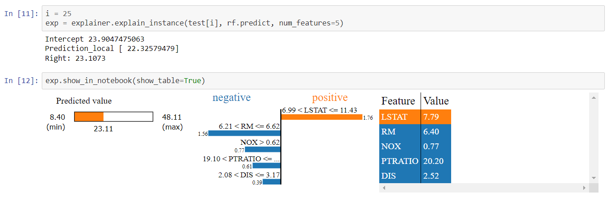

# Nuggies Model Explainer (Lime) Tutorial
How to use model explainers

## Why are Model Explainers Helpful?

//A brief explanation of what model explainers are, an overview of Lime, and how they can be used.

### Helpful Video
* [Brief Introduction to Lime](https://youtu.be/hUnRCxnydCc)

## Applying LIME

//A guide on how to apply LIME to their current models to understand what is happening.

## What Does This Info Mean?

Your Lime output should look something like this:

When you call the `explain_instance` method, Lime creates a linear model for the specific instance of the data that you gave it and makes a prediction.

The intercept is the prediction the model Lime created would have made if the weights of all the features were zero. Prediction_local is the prediction that the model Lime created made. Right is the prediction that your actual model made.

Looking at the charts, that chart on the far right is the prediction that the model made. The chart in the middle displays each of the features and their weights, as well as whether those weights are positive or negative. The longer the bar, the larger the weight is, which indicates that the feature had greater importance when determining the predicted value. The chart on the far right displays each feature and their actual weights.

## Resources
* [Lime GitHub Repo](https://github.com/marcotcr/lime)
* [Lime Documentation](https://lime-ml.readthedocs.io/en/latest/)
* [Lime Tutorial (GeeksforGeeks)](https://www.geeksforgeeks.org/introduction-to-explainable-aixai-using-lime/)
