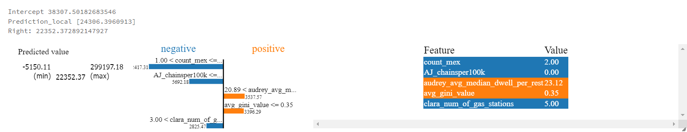
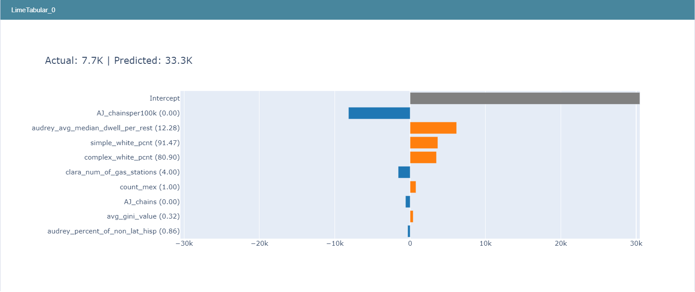

# Lime_Nuggies
How to use model explainers

"In the beginning machines learned in darkness, and data scientists struggled in the void to explain them.
Let there be light." - [InterpretML](https://pypi.org/project/interpret/)

## Why are Model Explainers Helpful?

Explainable artificial intelligence (XAI or "model explainers") is a "set of processes and methods that allows human users to comprehend and trust the results and output created by machine learning algorithms" ([IBM](https://www.ibm.com/watson/explainable-ai)). The point of Explainable AI is to allow a person to understand how an AI model is arriving at a specific result. This makes it easier to determine adjustments that need to be made to a model or whether or not a model can be trusted.

Local interpretable model-agnostic explanations (LIME) is a type of XAI method. LIME focuses on approximating a model's behavior at a specific instance, and then allowing users to investigate that behavior. LIME explainers typically focus on local explanations rather than explanations of the overall behavior of a model. You can use the explanations that are provided to see how much each feature affected the end result, and what kind of impact it had. If you combine multiple local explanations, you can start to gain insight into how the model is using the data it has been provided to make its conclusions.

### Video Overview
* [Introduction to Lime](https://youtu.be/hUnRCxnydCc)

"There are many advantages to understanding how or why an AI-enabled system has led to a specific output. Explainability can help developers ensure that the system is working as expected, it might be necessary to meet regulatory standards, or it might be important in allowing those affected by an decision to challenge or change that outcome. There can also be trade-offs or challenges involved in creating explainable AI: there may be a need to manage concerns about privacy, to consider access to intellectual property, or to put in place checks to ensure the explanations provided are reliable. " - [The Royal Society](https://royalsociety.org/topics-policy/projects/explainable-ai/)

## Applying LIME

There are multiple different LIME explainer options that can be used in Python; we will be using the Lime package and the interpret package, which you can find on GitHub [here](https://github.com/marcotcr/lime) and [here](https://interpret.ml/docs/lime.html).

Download the workbook titled "Model Explainers - Lime" located in this repository.

## What Does This Info Mean?

Starting with the Lime package, your output should look something like this:

When you call the `explain_instance` method, Lime creates a linear model for the specific instance of the data that you gave it and makes a prediction.

The intercept is the prediction Lime's model would have made if the weights of all the features were zero. Prediction_local is the prediction that Lime's model actually made. Right is the prediction that your model made.

Looking at the charts, that chart on the far left is the prediction that the model made; sometimes you will see a bar to go with it, and sometimes you will not (like in this example). The chart in the middle displays each of the features and approximately how much the approximated model added to or removed from the intercept based on that feature to get its final result. Above each bar, you can see how the approximated model is using the feature to determine what value to add to or subtract from the final result. The chart on the far right displays each feature and their actual values.

Next, the interpret package. Your output should look something like this:

Intercept displays the same information as the intercept returned by the Lime package, just as a bar on the chart. Actual is the real value of the target at that instance. Predicted is the final prediction that your model made at that instance.

Each of the labels on the y-axis displays the feature and its value at that instance, and the bars represent the same information as the bars in the middle chart in the Lime package output.

Regardless of which package you are using, by creating explanations for several different instances and comparing them, you can start to gain insight into what your model is doing, and what features may or may not be important.

## Resources
* [Lime GitHub Repo](https://github.com/marcotcr/lime)
* [Lime Documentation](https://lime-ml.readthedocs.io/en/latest/)
* [Lime Tutorial (GeeksforGeeks)](https://www.geeksforgeeks.org/introduction-to-explainable-aixai-using-lime/)
* [What is XAI?](https://www.ibm.com/watson/explainable-ai)
* [InterpretML Lime](https://interpret.ml/docs/lime.html)
